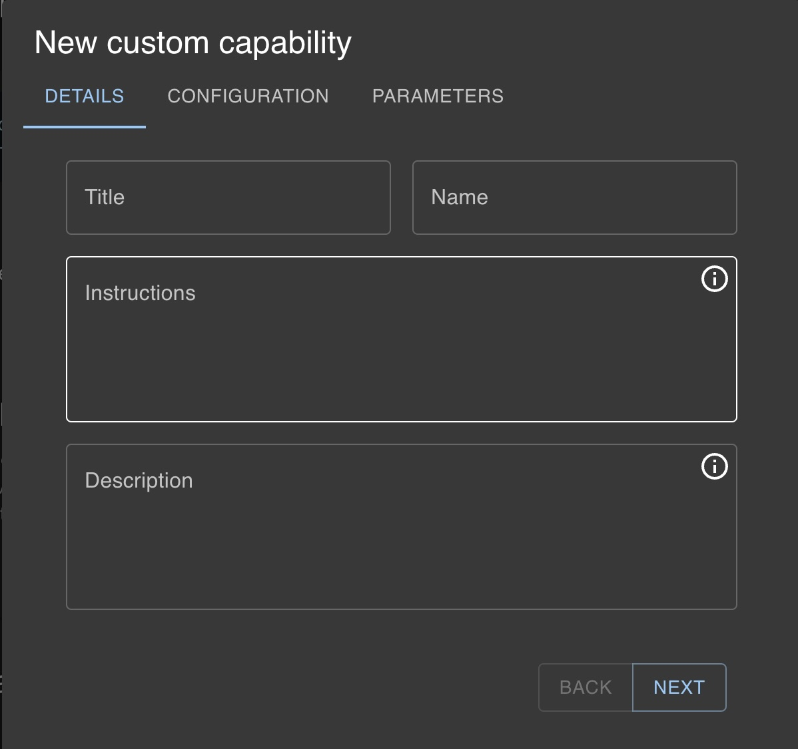
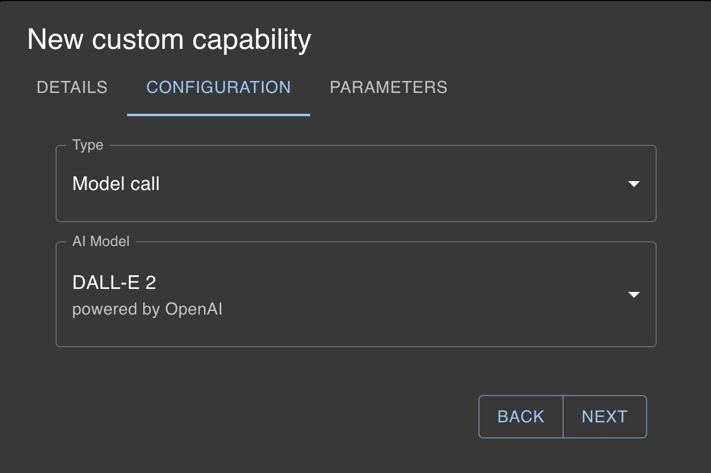
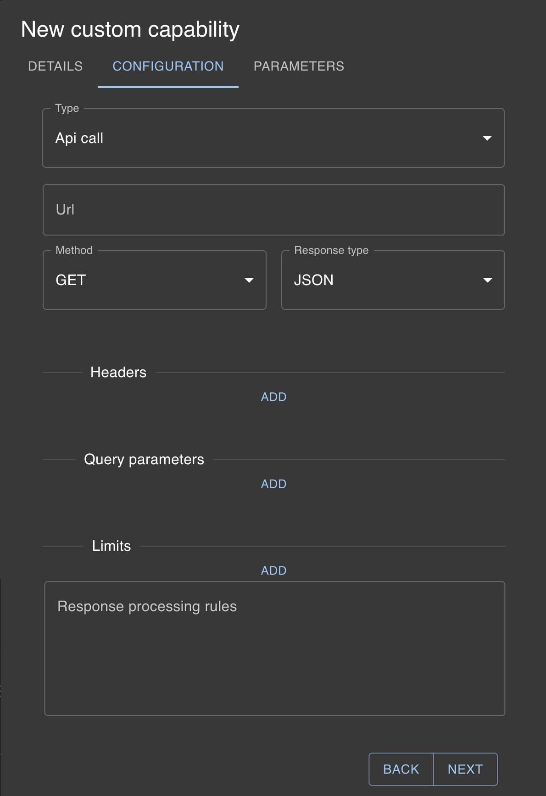
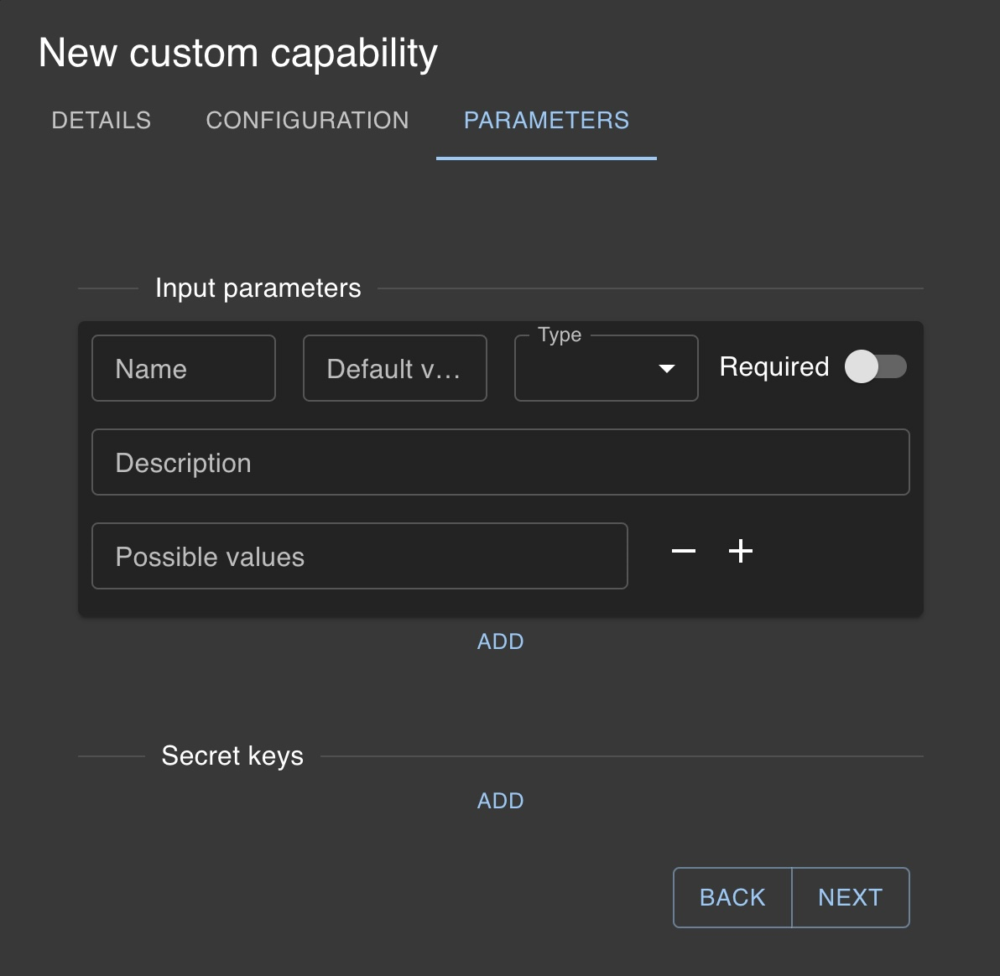

# Custom capabilities

In addition to utilizing existing additional capabilities, you have the option to create your own custom additional capabilities. This process is similar to what many AI providers refer to as _function calling_, but with unique specific features. Currently, Blust AI supports two types of additional capabilities:

1. **API Calling**: Invoking an external API.  
2. **Model Calling**: Invoking another AI model.

## Adding a Custom Additional Capability

To add a custom additional capability:

Click the `+ NEW CAPABILITY` button. 

This will open a modal window with three tabs.

### First Tab: Details

This tab is consistent across all types of additional capabilities and requires filling out four fields:

`Title`  
The name of the additional capability.  

`Name`  
A unique function name that will be passed to the AI model.  

`Instructions`  
Detailed description of what your additional capability does, to ensure the AI model understands when to execute this function. Be specific about its functionality.  

`Description`  
A brief description of what the capability does.  

### Second Tab: Configuration  

The content of this tab varies depending on the type of additional capability being added.

#### For Model Calling:

You only need to select the `AI model` to invoke.

#### For API Calling:

`URL`  
The endpoint of the API to be called.  

`Request Type`  
GET or POST.  

`Expected Response Type`  
Plain text or JSON.  

`Headers`  
HTTP request headers.  To dynamically include context-defined variables, use double curly braces to enclose the variable name (e.g., **\{\{variable_name\}\}**) and specify it as a parameter on the following tab.

`Query Parameters`  
Key-value pairs to be sent in the query string _(if GET)_ or in the body _(if POST)_.  To dynamically include context-defined variables, use double curly braces to enclose the variable name (e.g., **\{\{variable_name\}\}**) and specify it as a parameter on the following tab.

`Limits`  
If the API server limits the number of requests, specify them here.  

`Response Processing Rules`  
If the API returns JSON, you can define a template for transforming the response using the Mustache template system. More information can be found at [Mustache template system](https://github.com/mustache/mustache).  

:::info[Secret Keys]
If the API request requires authorization or secret keys, utilize the _secret keys_ functionality. To use a secret key as a header or query parameter, enclose its name in double curly braces, e.g., **\{\{API_KEY\}\}**. The actual _API_KEY_ can be set in the `Parameters` tab.
:::

### Third Tab: Parameters

Define an array of parameters your AI tool needs to pass to the API, including their descriptions:

`Name`  
The name of the parameter.  

`Default Value` Optional  
A default value for the parameter.  

`Type`  
The data type of the parameter (_string_, _number_, or _boolean_).  

`Description`  
A clear description of what the parameter represents, to ensure the AI model passes the correct data.  

`Required`  
Whether the parameter is mandatory.

**Secret keys**

Secret keys, if utilized in the previous tab, can be added here. These keys are shared across all of your custom capabilities.

`Name`  
The name of the key as defined in the previous stage (e.g., _API_KEY_).  

`Secret Key`  
New or existing secret key, securely stored on our server.  

:::note
In the near future, we plan to allow AI  creators to share and monetize  their Custom Additional Capabilities
:::

In the next sections, you can find examples of configuring additional capabilities.