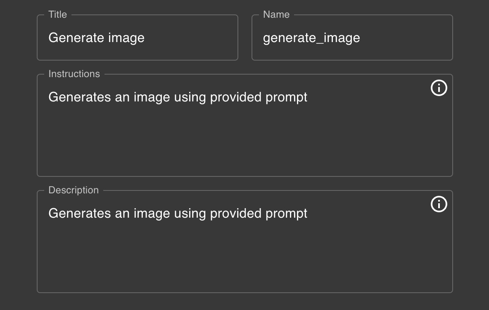
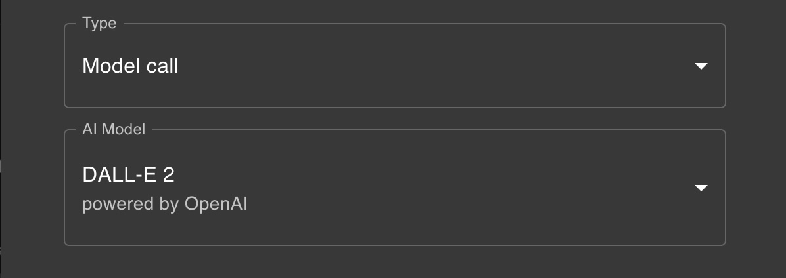
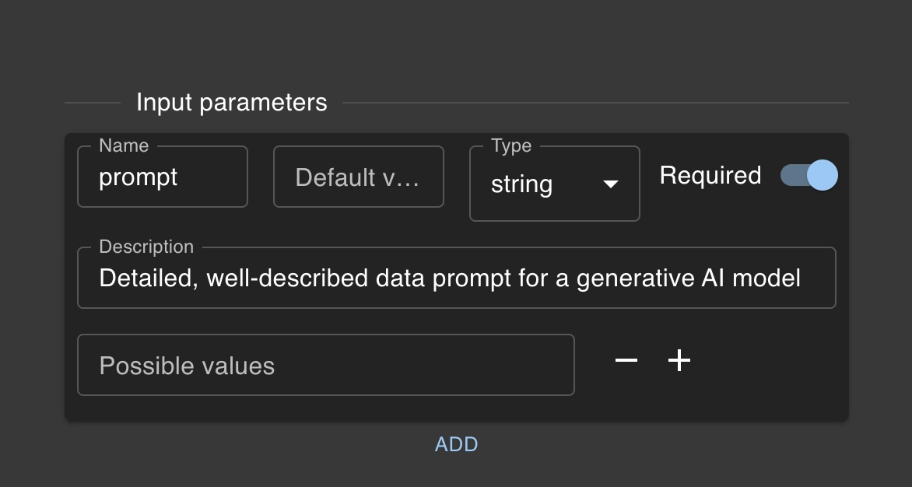

import Tabs from '@theme/Tabs';
import TabItem from '@theme/TabItem';

# Example 2: Generating Images

This example demonstrates how to configure a custom additional capability to generate images using the DALL-E 2 AI model.

<Tabs>
<TabItem value="Details" label="Details" default>

</TabItem>
<TabItem value="Configuration" label="Configuration">

</TabItem>
<TabItem value="Parameters" label="Parameters">

</TabItem>
</Tabs>