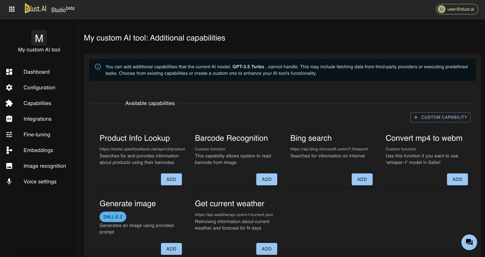
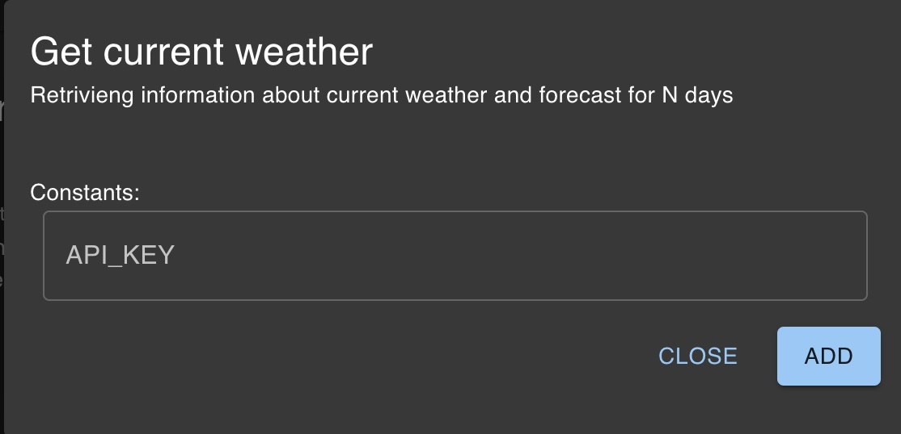

# Additional capabilities

**Additional capabilities** (also known as **plugins**), are designed to enhance AI tools by providing data sources and executing tasks that the default AI model cannot perform. These capabilities enable the AI tools to undertake tasks beyond their default abilities.

## Availability

The availability of additional capabilities depends on the specific AI model in use. When available, a list of these capabilities will be visible in the Capabilities section of the dashboard.

## Examples of Additional Capabilities

The following are some of the additional capabilities that can be integrated into AI Tools:

**Bing search**: Enables the AI tool to perform web searches to gather information.  
**Generate image**: Allows the AI tool to generate images based on specified parameters.  
**Barcode Recognition**: Identifies barcodes in uploaded images.  
**Product Information Lookup**: Searches for and provides information about products using their barcodes.  
**Get current weather**: Retrivieng information about current weather and forecast for N days

## Configuration of Additional Capabilities

Some additional capabilities offer customizable settings. For instance, the **Get Current Weather** capability allows you to use a custom API key.

## Custom Additional Capabilities
For users with specific requirements, Blust AI Studio offers the ability to create custom additional capabilities.

For detailed instructions on creating custom additional capabilities, refer to the [following section](/docs/creating-ai-tools/capabilities/custom_capabilities)

