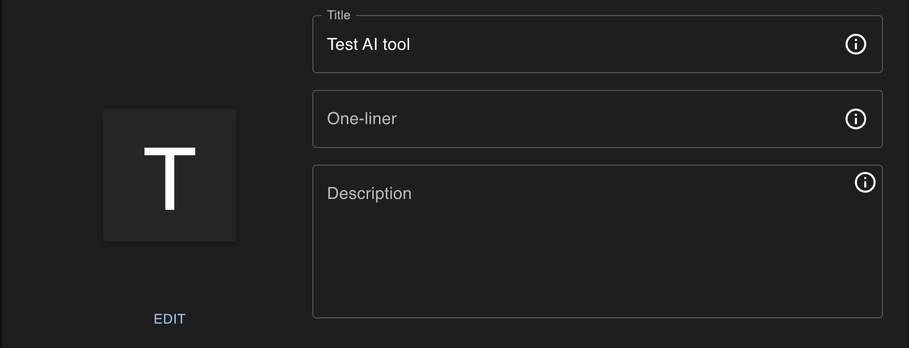
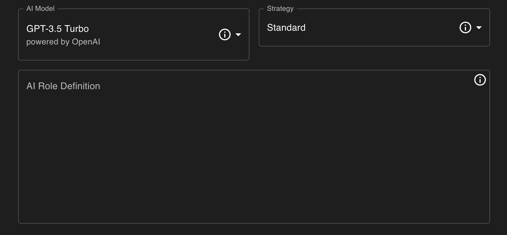
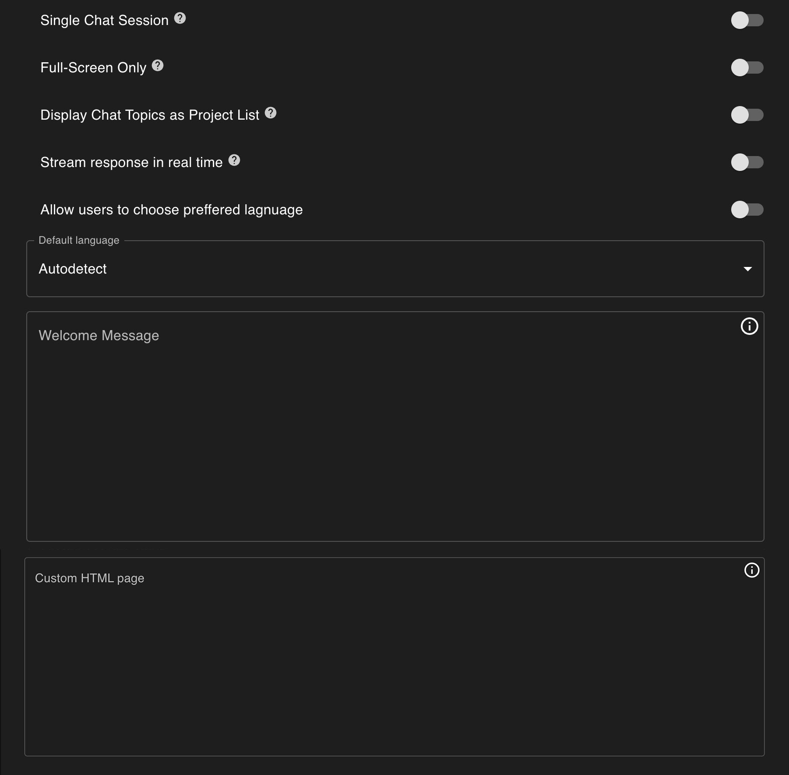
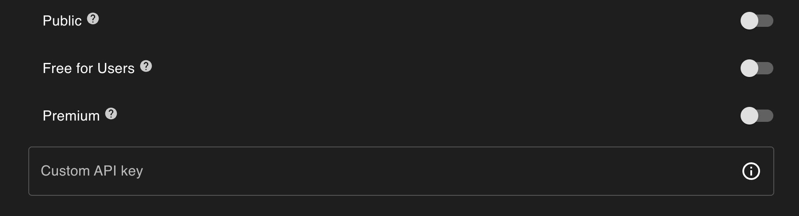

import Tabs from '@theme/Tabs';
import TabItem from '@theme/TabItem';
import SimpleModeConfigurationFields from './../../_modules/simple_mode_configuration_fields.md'

# Configuration

In this section, we detail the configuration options available for customizing and optimizing your AI tool within blust.AI Studio. The settings are organized across four tabs, each dedicated to a different aspect of your tool's setup and operation. 

<Tabs>
  <TabItem value="Details" label="Details" default>

    Title, one-liner and description,  are fields that define the basic information about your AI tool. These details are essential for users to understand the purpose of your tool and are required before submitting your tool for catalog inclusion.

Additionally, you can update your AI tool's avatar by providing a prompt for its description. Manual icon uploads are not supported at this time.
  </TabItem>
  <TabItem value="Configuration" label="Configuration">

<SimpleModeConfigurationFields />

  </TabItem>
  <TabItem value="Appearance" label="Appearance">
    

`Single Chat Session` 

When enabled, each user's interaction with the system is contained within a single thread. Disabling allows users to start new threads.

`Full-Screen Only`

Ensures that the chat interface launches in full-screen mode without the option to resize or minimize.

`Display Chat Topics as Project List`

This setting, when enabled, displays threads as Cards at the tool's launch, allowing users to choose from a visual list of projects. This format is particularly useful for tools designed to manage or navigate multiple distinct projects.

`Stream Response in Real Time`

Activating this feature allows the AI's responses to be displayed dynamically as they are generated, offering a more interactive experience. Compatibility with real-time streaming varies by AI model, and should be verified, especially when using complex data formats like JSON.

`Allow Users to Choose Preferred Language`

This option enables users to select their preferred language for each chat session, enhancing the accessibility and user-friendliness of the AI tool.

`Welcome Message`

Specify a greeting to initiate every interaction, setting a welcoming or informative tone for the conversation. This message is an opportunity to personalize the user's experience with your AI tool. 

`Custom HTML Page`

Here, you can provide HTML code for additional content to be displayed below the chat interface. This feature allows for the integration of extra information, branding elements, or other relevant materials, visible when 'Full-Screen Only' is not active. Ensure the HTML is designed for optimal display and user interaction.

  </TabItem>
  <TabItem value="Access" label="Access">
    

`Public`
Determines whether your AI tool is accessible to anyone with the link or remains private for your use only.

`Free for Users`
Indicates whether your AI tool is available for free to end-users, with any associated costs being your responsibility.

`Premium` 
Making your AI tool premium restricts access to paid users only, ensuring revenue generation from user interactions. This setting excludes non-registered or free-plan users from access, necessitating a consideration of the benefits of exclusivity against the potential of reaching a broader audience initially.
  </TabItem>

</Tabs>

