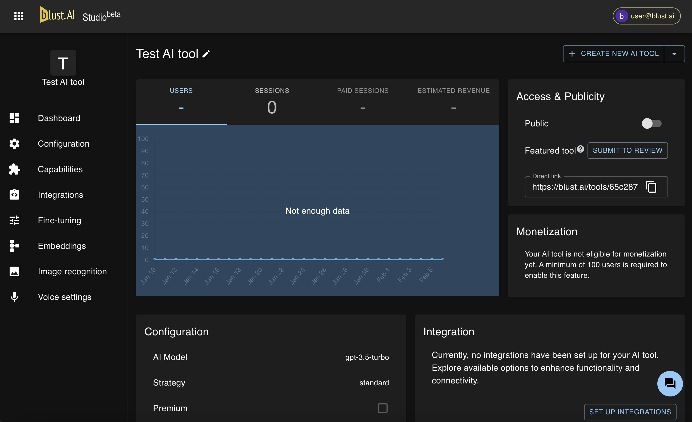

# Dashboard

The Dashboard provides key management and analytics tools for your AI tool. It offers insights into user engagement and potential revenue through various metrics displayed on graphs. These include the number of users, session counts, the number of sessions by paying users, and an estimated revenue total. Note that the revenue figure is approximate and subject to change at the end of the month.

## 'Public' Toggle

A switch on the Dashboard controls whether your AI tool is accessible to other users. If the "Public" toggle is set to off, your AI tool is only available to you. If set to ON, your tool can be accessed by all users through a link, which can be copied from the "Direct Link" field.

:::note
The "Public" field only affects the tool's accessibility via your direct link and does not influence its availability in the catalog. To remove your AI tool from the catalog, please contact the support team.
:::

## Catalog Submission

To have your AI Tool listed in the main catalog, you need to submit your tool to review. Once reviewed and approved by our team, your tool will be added to the catalog, and a "Catalog Link" to the approved version of your tool will be provided.

:::info[Direct Link vs. Catalog Link]
Note that the "Catalog Link" differs from the "Direct Link." The first one directs users to the latest approved copy of your AI tool. Any changes made post-approval are only accessible via the "Direct Link." This setup allows for safe experimentation and modifications to your AI tool. To update the tool listing in the catalog, a new submission for review is required.
:::

For information on configuring AI tool's settings, refer to the [Configuration](/docs/creating-ai-tools/configuration/) section.
