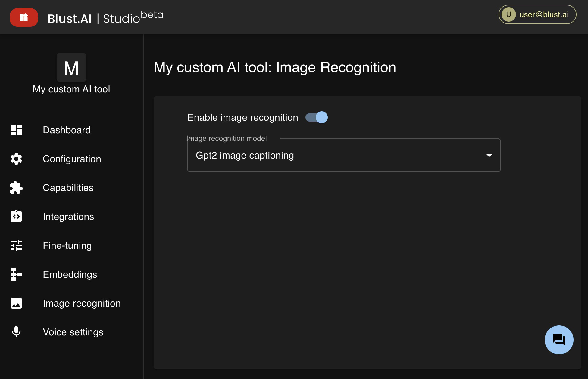

# Image Recognition

## Enabling Image Recognition

If the AI model you've chosen does not support image recognition natively, you can enhance your AI tool with image recognition capabilities by utilizing other AI models.

To add this feature:

1. Go to the **Image Recognition** section.
2. Toggle the `Enable image recognition` switch to the **ON** position.
3. Select the AI model that will be responsible for recognition tasks.

:::warning
Please note that enabling image recognition may increase the cost of using your AI tool.
:::
