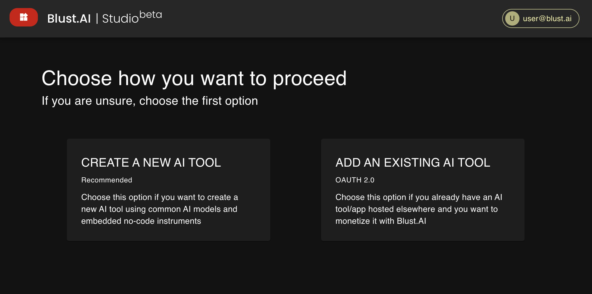

import SimpleModeConfigurationFields from './../../_modules/simple_mode_configuration_fields.md'

# Simple mode

This section provides instructions for creating a new AI tool in [Blust.AI Studio](https://studio.blust.ai).

## Initial Steps

Upon creating a new AI tool, the system offers two options:

- Create a new AI Tool
- Attach an existing AI Tool

To create a new tool, click on the `Create a New AI Tool` button. For adding an existing tool, refer to [Integrating Existing AI Tools](/docs/integrating-ai-tools)

## Simple Mode Configuration

In Simple Mode, complete four fields:

<SimpleModeConfigurationFields />

`Title`

The **Title** field specifies the name of your AI tool. It is used for identification and reference within the blust.AI platform. Choose a concise and descriptive title that reflects the tool's function or intended use.
    
    
   
After clicking the `Create AI Tool` button, you will be redirected to the Dashboard, where you can perform detailed configuration and enhance your AI tool by adding additional capabilities.

:::tip

For detailed settings, switch to _Advanced Mode_. Advanced Mode fields are described in [Configuration](/docs/creating-ai-tools/configuration) section. 

:::

