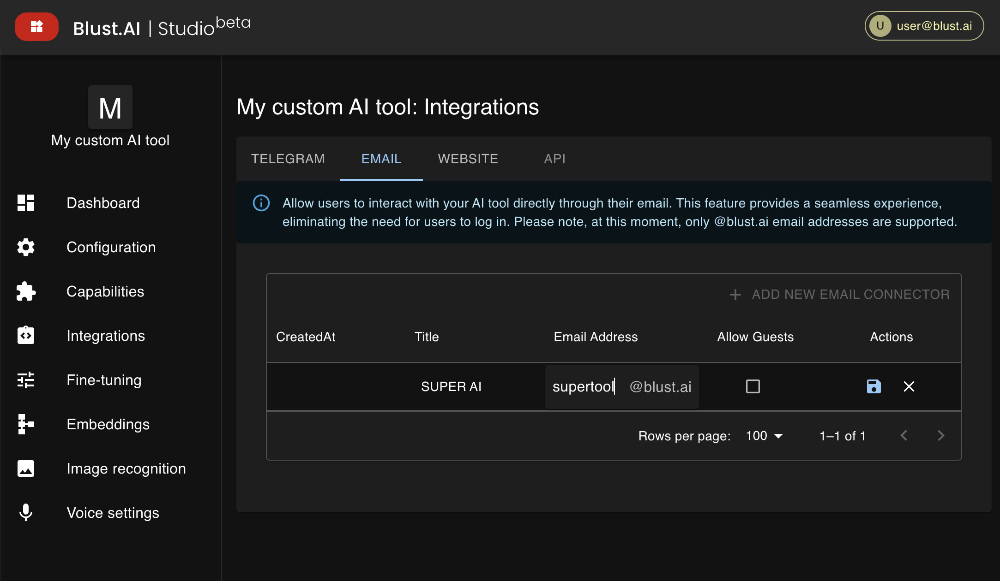

import SaveIconSvg from './../../assets/icons/save.svg';

# Email Integration

## Creating an Email Connector

To allow your AI tool to interact with users via email, create a new email integration:

1. Go to the **Integrations** section and choose the `Email` tab.
2. Click on `Add new email connector`.
3. Enter the name for your email integration.
4. Specify the desired email address and click on the 'Save' icon <SaveIconSvg className="svg-icon"  />.  
_Currently, only **blust.ai** addresses  are supported_.

After completing the integration, your bot will become accessible via the chosen email address. This means users can send emails to this address and receive responses generated by your AI tool.

### Allow Guests Option

The `allow guests` checkbox determines whether your bot will be accessible to everyone or only to registered Blust AI users:

- **To make your AI Tool's email replies free for all users**, enable `allow guests` and set your AI tool to _free for users_ in the [Configuration](/docs/creating-ai-tools/configuration/) section.

- If you're part of the monetization program and wish to earn from ALL interactions, disable `allow guests` and configure your AI tool as _premium_ in the [Configuration](/docs/creating-ai-tools/configuration/) section. In this case, only Blust AI users with a paid subscription will receive email replies from your bot; others will not.

:::info[Limitations]
Each AI Tool can be linked to a maximum of 3 email addresses.
:::