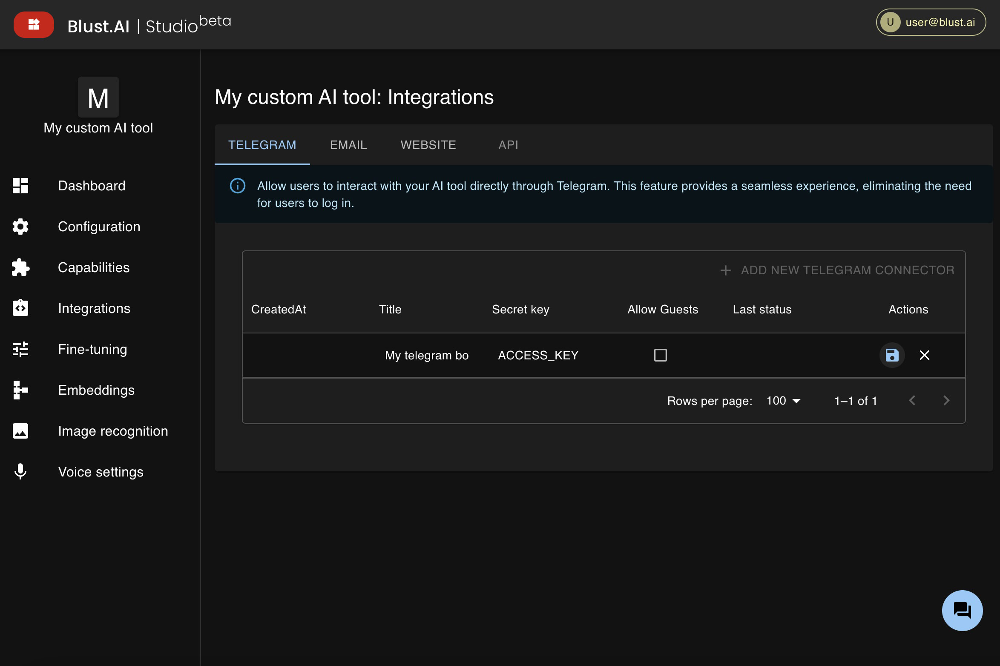

import SaveIconSvg from './../../assets/icons/save.svg';
import RefreshIconSvg from './../../assets/icons/refresh.svg';

# Telegram integration

## Creating a Telegram Bot

To integrate your AI tool with Telegram, start by creating a Telegram bot:

1. Open the Telegram app and search for **BotFather**.
2. Initiate a chat with BotFather and send the `/newbot` command.
3. Follow the prompts to name your bot and create a username. BotFather will then provide you with a _token_ for API access.

## Configuring the Telegram Connector

Once you have your bot token:

1. Navigate to the **Integrations** section and choose the `Telegram` tab.
2. Click on `ADD NEW TELEGRAM CONNECTOR`.
3. Enter the name of your Telegram bot _(this name is internal and does not affect the name seen by users)._
4. Enter the token provided by BotFather.
5. Click the 'Save' icon <SaveIconSvg className="svg-icon"  />.

### Allow Guests Option

The `allow guests` checkbox determines whether your bot will be accessible to all Telegram users or to registered Blust AI users only.

**To make your bot free for all Telegram users**, enable `allow guests` and ensure your AI tool is set to _free for users_ in the [Configuration](/docs/creating-ai-tools/configuration/) section.

If you're part of the monetization program and want to earn from ALL interactions, disable `allow guests` and configure your AI tool as _premium_ in the [Configuration](/docs/creating-ai-tools/configuration/) section. In this case, only Blust AI users with a paid subscription will be able to interact with your bot; others will receive an error message.

### Monitoring and Updating Connection Status

The connection status with your Telegram bot is displayed in a table. After making any changes, click the `refresh` icon <RefreshIconSvg className="svg-icon"  /> to update the connection status.

:::info[Limitations]
Each AI Tool can be integrated with a maximum of 3 Telegram bots.
:::