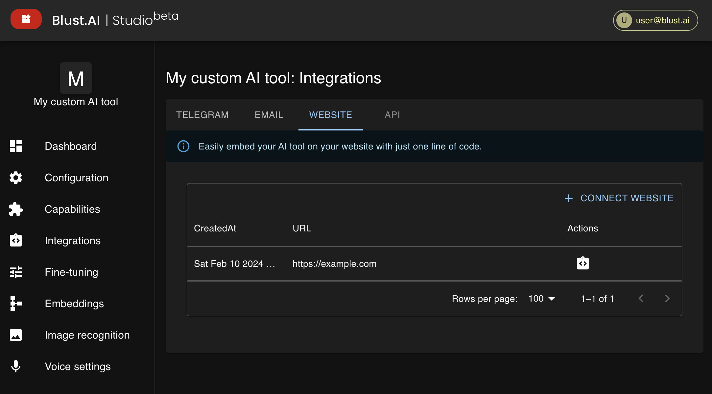
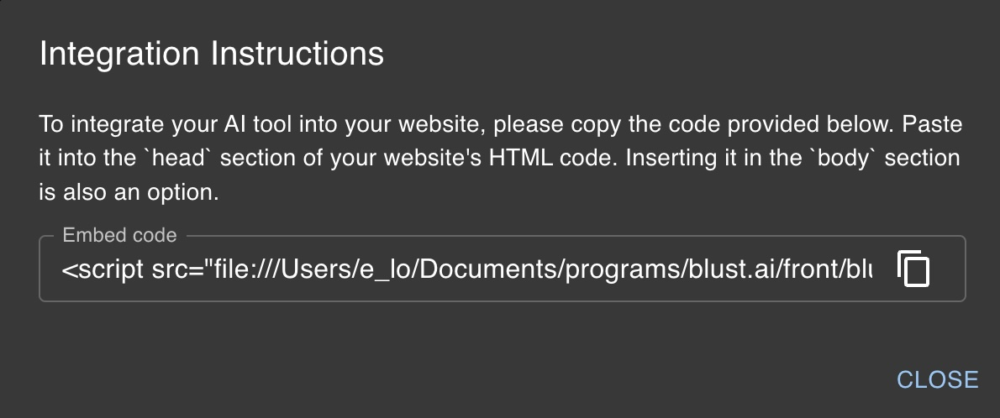

import SaveIconSvg from './../../assets/icons/save.svg';
import IntegrationInstructionsIcon from './../../assets/icons/integration_instructions.svg';

# Integration with External Websites

## Adding Your AI Tool to an External Website

You can integrate your AI tool into any external website under your control. Please note that for this integration, your AI tool must be set to _Free for Users_, meaning you, as the owner, will be responsible for any associated costs.

To add your AI tool to an external website:

1. Navigate to the **Integrations** section and choose the `Website` tab.
2. Click on the `Connect website` button.
3. Enter your website URL and click on the 'Save' icon <SaveIconSvg className="svg-icon"  />.

4. After saving, click on the 'Integration instructions' icon <IntegrationInstructionsIcon className="svg-icon" /> to find your `Embed code` in the opened modal window.

5. Copy and paste this code into any part of the HTML code of your webpage.

_While it is generally recommended to place the code inside the `<head>` tag for optimal performance, inserting it inside the `<body>` tag is also acceptable._

:::info[Limitations]
Each AI Tool can be integrated with up to 3 external websites.
:::

