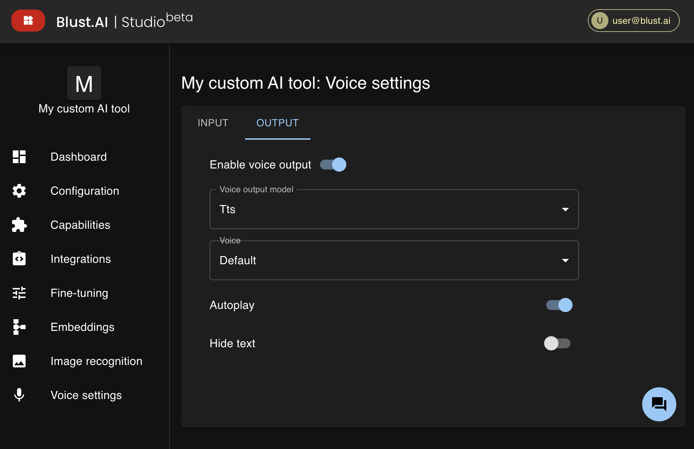

# Voice Settings

## Enabling Voice Interaction

Your AI tool can interact with users using voice, offering a more intuitive and engaging user experience.

### Voice Input

To enable voice input:

1. Go to the **Voice Settings** section.
2. Toggle the `Enable voice input` switch to **ON**.
3. Select the AI model responsible for voice recognition and your preferred language for voice input.  
_You may choose `Autodetect` for language, but be aware that it might work less reliably and cause mistakes_.

The `Do not show transcribed text` option determines how user messages appear in the message history. If the switch is **ON**, users will see their messages as audio files only; if **OFF**, transcriptions of the voice messages will also be available.

### Voice Output

To enable voice message playback:

1. Navigate to the **OUTPUT** tab.
2. Toggle the `Enable voice output` switch to **ON** and select the AI model that will generate the voice.
3. _(Optional)_ You can choose whether to show text messages in the message history or only play audio.
4. _(Optional)_ You may enable automatic playback of new messages by switching `Autoplay` switch to **ON**.

Some AI models offer extra settings, such as _OpenAI's TTS_, which allows you to choose the `Voice`.

:::warning
Please note that voice features significantly increase the cost of using your AI tool.
:::
