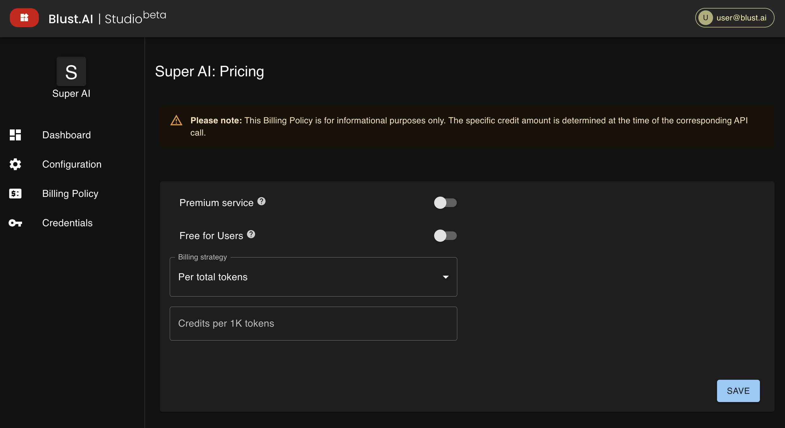

# Billing Policy

Define the availability and pricing of your service here. Choose between offering your tool as a premium service or making it free for users, each with its own implications for user access and revenue generation.

## Billing Strategy

Decide on your billing approach:
- Per total tokens
- Per input/output tokens
- Per result/request

:::note
Prices are for informational purposes. The specific credit amount is determined at the time of the corresponding API call.
:::

