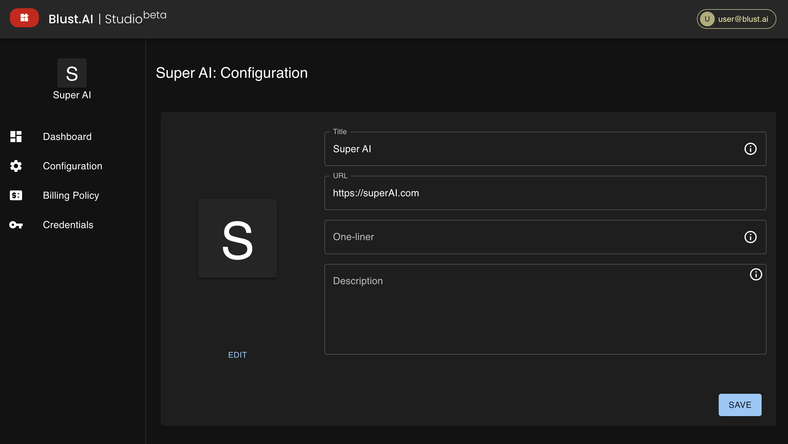

# Configuration

Title, one-liner and description,  are fields that define the basic information about your AI tool. These details are essential for users to understand the purpose of your tool and are required before submitting your tool for catalog inclusion.

Additionally, you can update your AI tool's avatar by providing a prompt for its description. Manual icon uploads are not supported at this time.