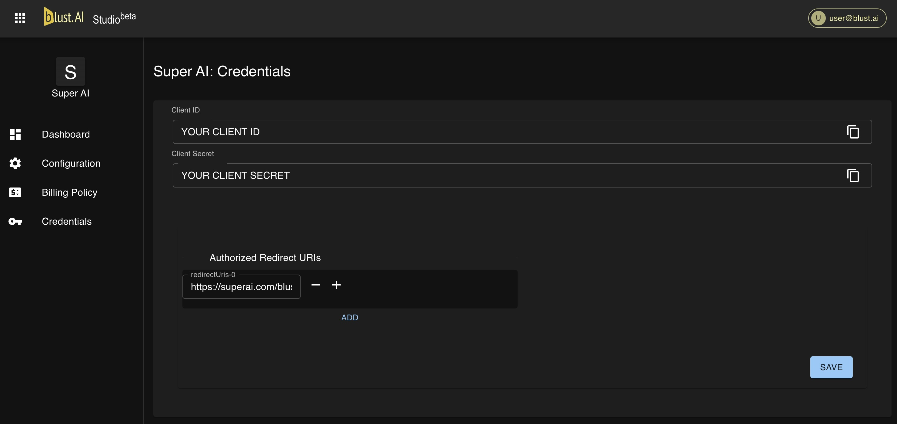

# Credentials

Secure integration requires careful management of your API credentials. This section provides detailed information on accessing and handling these credentials to ensure the security of your AI tool and user data.

`Client ID` 

Your tool's unique identifier for OAuth authentication. Use it to initiate user authentication processes.

`Client Secret`

A sensitive key required for the authentication of your tool. This secret should never be shared and must be kept confidential to prevent unauthorized access.

`Authorized Redirect URIs` 

A list of your endpoints users can be safely redirected to after successful authentication. At least one redirect URI is required to make your AI tool accessible from our catalog. You can add multiply endpoints but only the first one used as a link to your AI tool.

Proper management of these credentials is paramount for maintaining the security and integrity of your AI tool and user interactions.