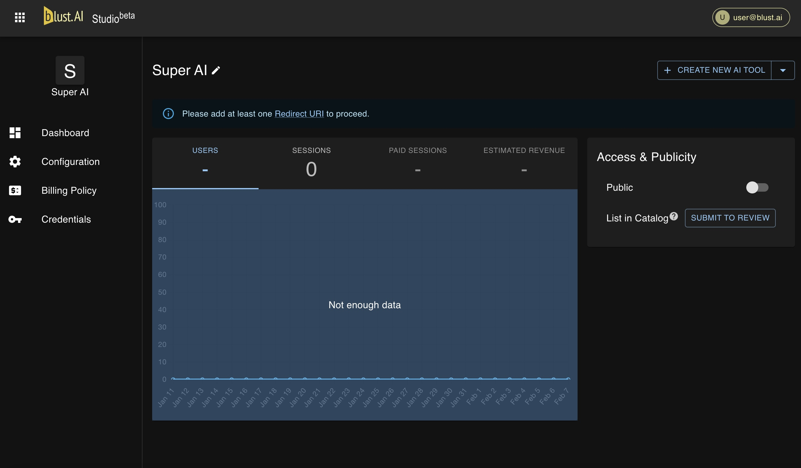

# Dashboard

The Dashboard is your central management tool, providing insights into user engagement, billing policies, and revenue potential. It features metrics such as user count, session activities, and estimated revenue.

`Public` toggle allows you to control the availability of your AI tool.

:::note
`Public` toggle only affects the tool's accessibility via your direct link and does not influence its availability in the catalog. To remove your AI tool from the catalog, please contact the support team.
:::