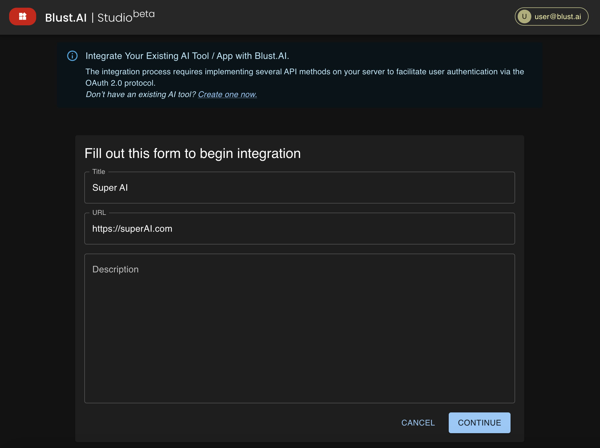

# Overview

The integration process between **Blust AI Studio** and external AI tools is designed to seamlessly connect users with a wide range of AI tools. Once an AI tool is registered and listed in the blust.AI catalog, users selecting the tool are redirected to a predefined endpoint with a secret _authorization code_. Tool owners must use this code to obtain a _user token_, used for tracking service usage and enabling accurate billing in blust.AI credits.

## Initial Steps

To integrate your AI tool with Blust AI Studio, start by registering your tool within the blust.AI.

1. **Go to** [`https://studio.blust.ai/dashboard/attach`](https://studio.blust.ai/dashboard/attach) to add your AI tool.

2. **Fill out the form** with the following details:
   - **Title**: Name of your AI tool.
   - **URL**: Web address where your AI tool is hosted.
   - **Description**: A brief overview of your tool. Can be updated later but is required before listing.

After submission, you will be directed to the Dashboard for further actions.
